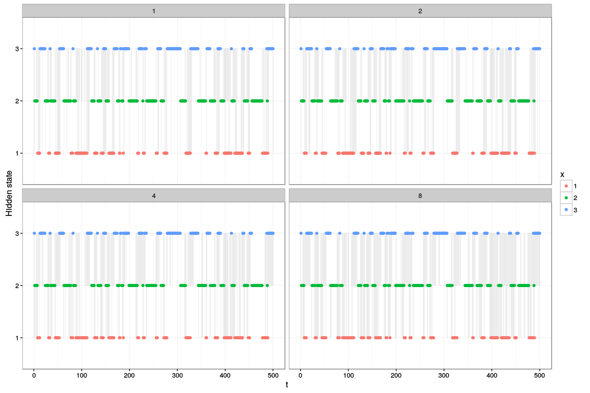
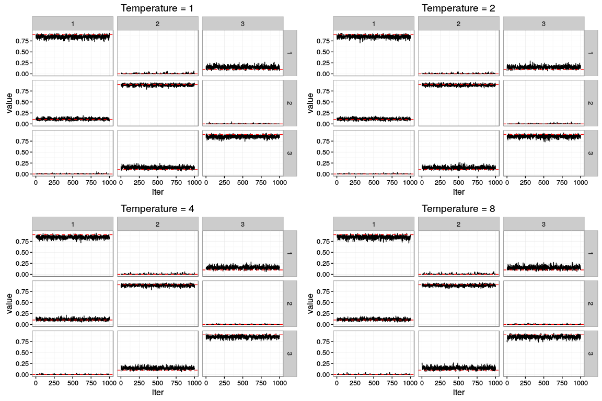
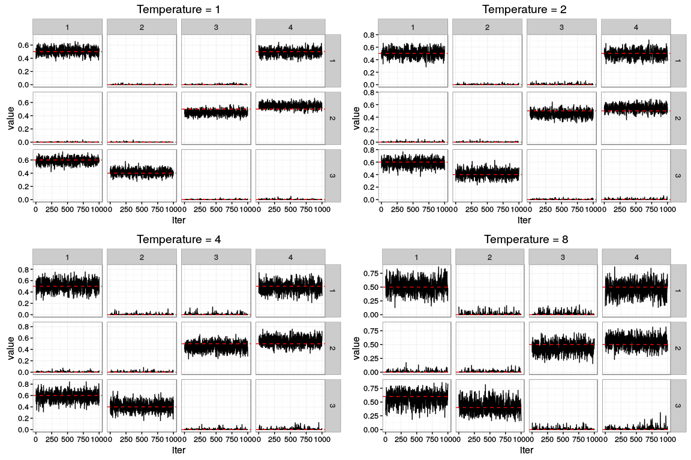

### Parallel tempering for HMMs

For testing purposes, at the moment there are just parallel chains run at different temperatures, no swaps between chains happen.

Pick temperatures \(\{1, 2, 4, 8\}\) and generate the same data as for `experiment01.Rmd`.

    ## iter 100 
    ## iter 200 
    ## iter 300 
    ## iter 400 
    ## iter 500 
    ## iter 600 
    ## iter 700 
    ## iter 800 
    ## iter 900 
    ## iter 1000 
    ## iter 1100 
    ## iter 1200 
    ## iter 1300 
    ## iter 1400 
    ## iter 1500

### Draws of \(x_{1:T}\)

### Elements of the transition matrices

#### A

#### B

### Transition matrices without relabelling

Same as before, but do not relabel each iteration (only match the first `burnin + 1` iteration).

#### A

#### B

